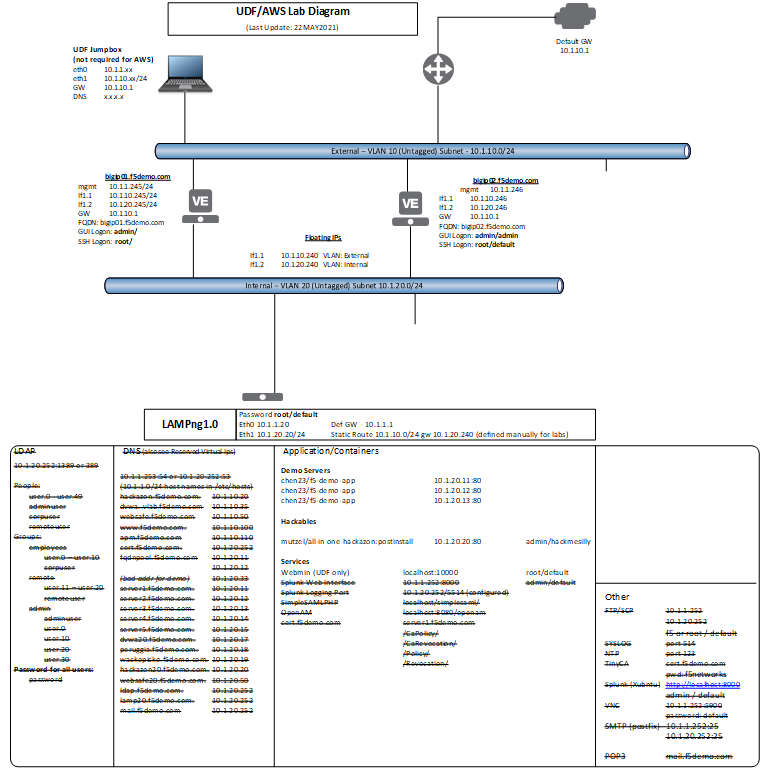

F5 Channel SE - AWS Lab Environment
===================================
**(BETA)**
This environment is available for use by engineers wishing to build a lab environment in AWS using the provided AWS Cloud Formation Template (CFT) that is compatible with the labs available on this site or in the partnerlabs container available on on the web site http://labs.f5omaha.com, in a docker container https://hub.docker.com/repository/docker/leifbr/partnerlabs and after you bring up the AWS lab at the Webserver Public URL in the Outputs.

**IMPORTANT**

**Deploying this cloud formation template WILL INCUR COST.** According to the AWS estimate it should be less than 0.30 USD per hour to run the lab using free trial BIG-IP or a BYOL BIG-IP.  Regardless you run this lab at your own risk. Neither myself or F5 is responsible for any cost you incure. 
**I highly recommended budget reminders.**

Some things to know when using the the **f5-aws-bigip-labs.yml** CFT template.  It is based off the 3nic PAYG learning stack found here: https://github.com/F5Networks/f5-aws-cloudformation/tree/master/experimental/standalone/3nic/learning-stack/payg

A big difference is the IP addressing is standardized (as much as possible) around the F5 Unified Demo Framework (UDF) and WWFR lab environments, so as to keep the lab guides consistent and simplified.  The other difference is that the BIG-IP can be brougt up unconfigured, except for basic set up, with only base networking configured, or, using the AS3 json scripts and basic networking configuration to bring up preconfigure virtual servers and pools for the lab environment.

I will probably not explain everything you need to know, especially if you haven't used AWS much, but I will give you the basics of using the template.

Prerequisites
-------------
- Subscribe to Ubuntu 18.04 LTS – Bionic for backend server at https://aws.amazon.com/marketplace/pp/prodview-pkjqrkcfgcaog
- Subscribe to the F5 BIG-IP Virtual Edition you will be using:

**NOTE**
There is a **FREE TRIAL** once you subscribe for a BIG-IP. From the AWS website:
*Try one unit of this product for 30 days. There will be no software charges for that unit, but AWS infrastructure charges still apply. Free Trials will automatically convert to a paid subscription upon expiration and you will be charged for additional usage above the free units provided.*  

Once the free trial is up there is a hourly license charge for the BIG-IP instance you use, with the exception of the BYOL. Of course all instances incur EC2 costs.

   - F5 BIG-IP Virtual Edition - GOOD (PAYG, 25Mbps) at https://aws.amazon.com/marketplace/pp/prodview-lphsy6izllsmq?ref_=beagle&applicationId=AWS-Marketplace-Console (0.43/hr estimated EC2 and Licensing)
   - F5 BIG-IP Virtual Edition - BEST (PAYG, 25Mbps) at https://aws.amazon.com/marketplace/pp/prodview-v2lgyijcawiti?ref_=beagle&applicationId=AWS-Marketplace-Console (1.77/hr estimated EC2 and Licensing)
   - F5 Per-App-VE Advanced WAF with LTM, IPI, TC (PAYG, 25Mbps) https://aws.amazon.com/marketplace/pp/prodview-7ykhgfdcrjazq?ref_=beagle&applicationId=AWS-Marketplace-Console (0.47/hr estimated EC2 and Licensing)
   - F5 BIG-IP VE - ALL (BYOL, 2 Boot Locations) - https://aws.amazon.com/marketplace/pp/prodview-v2lgyijcawiti?ref_=beagle&applicationId=AWS-Marketplace-Console (0.40/hr estimate for EC2 charges, no licensing charges, can be used with evaluation keys)
   

Creating the stack
------------------

1. Clone the git respository to your device or just download the **f5_aws_bigip_labs.yml** CFT template which can be found here: https://github.com/leifbr/partnerlabs/blob/master/awslab/
2. Log in to your AWS account and your management console.
3. Search for CloudFormation (if you don’t already have it as a favorite) and click on CloudFormation
4. Select **Create Stack**
5. Select **Upload a template file** and hit the **Choose file** button.
6. Upload the **f5-aws-bigip-labs.yml** and click **Next**
7. Most of the template is self explanatory or can be defaulted, but here are some mandatory fields and addition notes for you.

   a. Under **Stack name** enter a name for your stack.
   b. Under **NETWORKING CONFIRGUTION** select an AZ (Availability Zone).
   c. Under **INSTANCE CONFIGURATION**

      1. **BIG-IP Image Name** The default is **GOOD25Mbps** which allows you to learn the basics and is inexpensive. All images selected here are v15.1.2.1
      2. **Custom Image Id** When you select any BIG-IP image above you will build a BIG-IP using an AMI for BIG-IP v15.1.2.1.  If you would like to work under another version, or if the lab requires another version, you can enter the AMI for that BIG-IP image here and it will override the **BIG-IP Image Name** selection.
      3. You can default until **SSH Key**.  Select your SSH key pair you want to use. 

      **IMPORTANT**
      **You must have a key pair to utilitize the lab.**  If you do not have a key pair, stop, and set one up.
 
      4. Source Address(es) for BIG-IP management and web application access. Enter your source IP or subnet to restrict lab access.  When in doubt you can just enter **0.0.0.0/0** and open it up wide .
   d. You can default until **BIG-IP BASE NETWORKING AND VIRTUAL SERVICE CONFIGURATION** here is where you will tell the BIG-IP how you want your lab set up.

      1. If you leave the defaults the BIG-IP will basically be a blank slate.  Yours to configure however you want.
      2. If you select **Yes** under **configBigipNet** the BIG-IP will be configured with the base networking for the labs (vlans, self IPs and default gateway)
      3. Under **AS3 Declaration URL** you can enter a link to the json that will configure your layer 4-7 services (pools, virtual servers, etc). 
      4. **CONSULT YOUR LAB GUIDE TO DETERMINE THE NETWORKING AND L4-7 SERVICES REQUIRED FOR YOUR LAB**
      
      **IMPORTANT**
      If you enter an AS3 URL make sure **configBigipNet** is set to **Yes** or you will end up with no configuration on the BIG-IP.

8. Hit **NEXT** 
9. If will take a few minutes for the environment to spin up and a little longer for all the containers on the backend server to come up.

Establishing access to the BIG-IP
---------------------------------

10. Once the stack is complete you can set up access to the BIG-IP

      a. Select your stack and select **Output**.
      
      b. Find the **Bigip1ManagementEipAddress**. This is the Elastic IP (EIP) you will this to connect to the BIG-IP
      
      c. Using PuTTY or SSH and your keypair, SSH to the BIG-IP.
      
      d. At the TMSH prompt enter
     
         mod auth user admin password <your password> shell bash

This will set the password for connecting to the TMUI (GUI) interface of the BIG-IP and allow the **admin** user to access the Linux CLI on the BIG-IP. This is the equivalent of giving a user **Advanced shell** privileges in the TMUI interface.

11. Go to the **Bigip1MgmtUrl** in **Outputs** tab of the stack (same as https://<Bigip1ManagementEipAddress>) and log into the TMUI with **admin** and your new password.  Basic set up has already been performed.

**NOTE**
If you are using an evaluation key or BYOL key you will have to activate the license the BIG-IP. That license key can be revoke prior to deleting the stack and used again.

12. Verify the containers are up and running by accessing this lab guide container on the back end server by going to the **WebserverPublicUrl**.
13. From **Outputs** make note of the following
   
    a. **Bigip1VipEip100** you will use this address to access any virtual server with the private IP (Bigip1VipPrivateIp100) of **10.1.10.100**
   
    b. **Bigip1VipEip105** you will use this address to access any virtual server with the private IP (Bigip1VipPrivateIp105) of **10.1.10.105**

14. Of course you can always refer back to the stack **Outputs** for this information.

**Congratulations!**  You are now ready to begin the labs.

Deleting the Lab Environment (AWS Stack)
----------------------------------------

You can stop and restart the EC2 BIG-IP and Webserver EC2 instances to reduce AWS charges, to retain you environment as is, but it is probably more economical to just delete the stack and recreate is later.

When you delete the stack on the CloudFormation page and all AWS objects built by the template will be removed.

If you do decide to delete the stack consider the following:

- If you are not done you can save you work via an UCS archive of the BIG-IP, download it to your PC, recreate the stack later and upload and restore the UCS archive.
- If you are using evaluation key or BYOL key you can **Revoke** the license and the key can be used again.  For evaluation keys that will be 30 or 45 days (depending on the key) after you first activated the key.

**IMPORTANT**
When using a **BYOL** or an **evaluation key** remember to **REVOKE** your license prior to deleting the stack.  The license can then be re-used to license the next stack you build.

Basic Network Diagram
=====================
   
A basic diagram of the network is provide here, there is NO second BIG-IP at this time.
   
