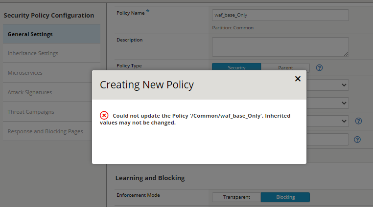

Create Base WAF Child Policy
============================
In this section you will create child profile based on the parent profile **waf_base** without any additional customizations.  This would be consistent with setting a base profile that could be used across multiple applications in your environment.

**Task 1 - Simulate attacks to demonstrate common web app vulnerabilities.**

You are going to open a browser window and simulate attacks against the, as of yet, unprotected Hackazon application.  You have two options for logging into the **ubu-jumpbox**, one is Microsoft Remote Desktop, **XRDP**, the other is **CONSOLE** which opens up the Linux GUI in a new browser window/tab.

You only access to a browser running on the jumpbox, the suggested method for this task is to use the **CONSOLE** access method.

#. Choose Your access method and at the login, select **f5student** as the user and use **f5UDFrocks!** as the password.
#. Select **Applications** in the upper left-hand corner and from the drop-down menu select **Internet** and then **Chromium Web Browser**.
#. Open browser and go to :guilabel:`http://10.1.10.100` to access the **Hackazon** website
#. Under **Special selection** click on any sale item displayed
#. Note the **product id** in the browser address bar

   .. image:: ./images/image392.png
     :height: 400px

#. In the browser address bar append :guilabel:`or 1=1` then press **Enter**

   .. image:: ./images/image393.png
     :height: 50px

   .. NOTE::

      This is a common :guilabel:`sql injection` attack and although this did not return
      anything exciting the search request was accepted and processed with response.

#. In the **Search field** enter :guilabel:`` and press **Enter**

   .. NOTE::

      This is a common :guilabel:`Cross-site scripting (XSS)` attack and although this did not return
      anything exciting the search request was accepted and processed with response.

      Also some modern versions of browsers will block this request from displaying a response, but the request was actually sent to the application.  If Chrome blocks it you can try on another browser.

**Task 2 - Create new waf policy to mitigate the vulnerabilities using info on table below:**

.. list-table::
    :widths: 20 40
    :header-rows: 0
    :stub-columns: 0

    * - **Policy Name**
      - waf_baseOnly
    * - **Policy Type**
      - Security
    * - **Parent Policy**
      - waf_base
    * - **Virtual Server**
      - hackazon_vs
    * - **Logging Profiles**
      - waf_log
    * - **Enforcement Mode**
      - Blocking

#. Select the **Security->Application Security->Security Policies->Policies List** page
#. Click **Create New Policy**

#. For **Policy Name** enter :guilabel:`waf_base_Only`
#. For **Policy Type** select :guilabel:`Security`
#. For **Parent Policy** enter :guilabel:`waf_base`
#. You will get a warning noting select a parent policy may change other settings. Review the setting selections and then select **OK** to accept warning.

.. NOTE::

  You will note that many of the selections are now greyed out because those selections are based on the parent policy.

#. For **Virtual Server** select :guilabel:`hackazon_vs`
#. For **Logging Profiles** select **waf_log**.
#. Change **Enforcement Mode** to :guilabel:`Blocking`

   .. image:: ./images/image311.png
     :height: 400px

#. Click **Save** in the upper left to save your new policy.

Whoops! It seems that we ran into an issue.  Go to https://askf5.com and enter the basic error message **Could not update the Policy. Inherited values may not be changed.** into the search box. 

As you look at the results you should find **Bug ID 986937: Cannot create child policy when the signature staging setting is not equal in template and parent policy**.  Open the Bug ID https://cdn.f5.com/product/
bugtracker/ID986937.html and check the bug *Conditions* and *Workaround*.

   .. NOTE::

      Staging is used to watch new policy changes, like updated signatures, in transparent mode for a defined period of time and will alarm and log, but not block violations.  This allows the WAF administrator time to determine if the new signatures are creating false positives.  In most circumstances you would not disable signature staging. While the lab could have been modified to avoid you seeing the bug we felt this was a good learning experience and a way for you to see bug tracker.

#. Let's implement the workaround by removing the parent policy. Click **Save** in the upper left to save your new policy.
#. Under **Security Policy Configuration** on the left select **Inheritance Settings**
#. Next to **Parent Policy** click on the drop-down menu and select **waf_base**, then select **Save** on the upper right.  You will now see the **Inheritance Settings**.
#. Select **General Settings** on the left and you will see most selections are now greyed out as the parent policy controls these security features.

   .. NOTE::
      As you can now see, parent profiles can be used to change existing profiles.

   .. NOTE::

      This creates a child security policy which inherits the settings from the
      waf_base Parent Policy.  The parent policy settings was created using Rapid
      Deployment Template which includes several common security measures and uses
      **Server Technologies** for attack signatures (see `Manual Chapter - Adding Server Technologies to a Policy <https://techdocs.f5.com/en-us/bigip-15-0-0/big-ip-asm-implementations/adding-server-technologies-to-a-policy.html>`_ for more information). Signature Staging is Disabled for this lab demo but it is enabled by default and should be enabled for production environments.

**Task 3 - Test WAF policy.**

Now let's review the security policies on our virtual server and test our new WAF policy.

#. Select the **Local Traffic->Virtual Servers->Virtual Servers List** page
#. Click the **hackazon_vs** to display Virtual Server Properties
#. Click the **Security->Policies** tab to display Policy Settings
#. In the **Log Profile** ensure :guilabel:`waf_log` profile is selected
#. Select **update**

   .. image:: ./images/image313.png
     :height: 300px

#. Open browser and go to :guilabel:`http://10.1.10.100/product/view?id=101 or 1=1`.  You should receive a block message similar to below. Take note of the **Support ID** number.

   .. image:: ./images/image314.png
     :height: 70px

#. Return to hackazon main page
#. In the **Search** field type :guilabel:`` and press **Enter**.  You should see a similar block message. Take note of the **Support ID** number.

**Task 4 - Review WAF event logs on BIG-IP GUI.**

#. Select the **Security->Event Logs->Application->Requests** page
#. Select the :guilabel:`Event` with the matching :guilabel:`Support ID` noted on the block pages

   .. image:: ./images/image315.png
     :height: 300px

   .. NOTE::

      You can view the "Decoded Requests" and the "Original Request" however the "Response" is not captured by default.

