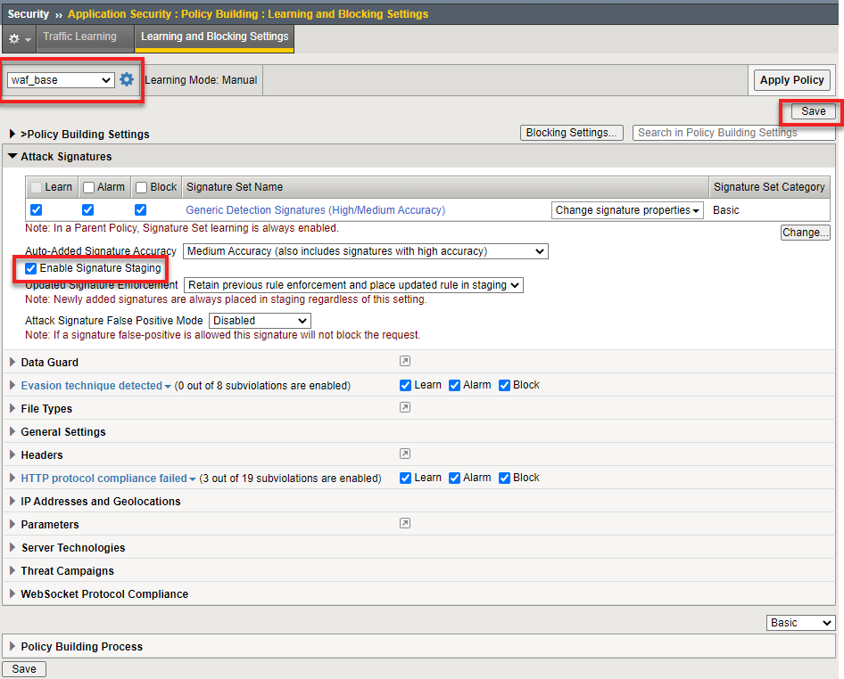
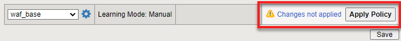

Update Parent WAF Policy
========================

In this short lab you will update the parent policy.  This will both demonstrate how child policies inherit changes to the parent policy and show how staging and transparency works.

**Task 1 - Update the parent policy to enable signature staging**

#. On the BIG-IP go to **Sercurity -> Application Security ->  Policy Building -> Learning and Blocking Settings** and ensure your parent policy, **waf_base** is selected.
#. Under **Policy Building Settings** expand the **Attack Signatures** setting and check the **Enable Signature Staging** box and select **Save** at the bottom or upper right.

#. You will see **Changes not applied** appear next to **Apply Policy**.  Apply the policy.

**Task 2 - See if the** waf_base_Only **policy inherited the changes**

#. Return to hackazon main page
#. In the **Search** field type :guilabel:`` and press **Enter**.  This time you will not see the blocking page.

**Task 3 - Review WAF event logs on BIG-IP GUI.**

#. Select the **Security->Event Logs->Application->Requests** page. Here you will see the signature violation was still logged and alarmed.

   .. NOTE::

      Staging allows the WAF administrator to review violations for new policy elements without actually blocking requests, thus lowering the chance of false positives affecting users.

